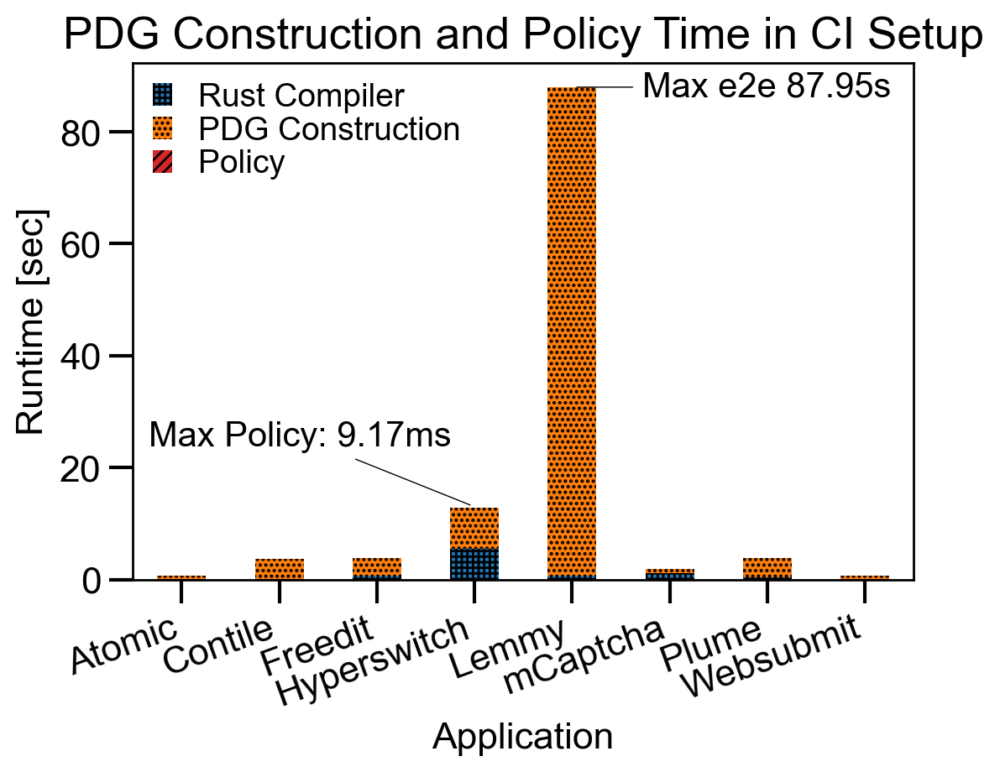

# Paralegal: A Privacy and Security Bug Finder for Rust Applications.

Paralegal is a static analyzer for Rust code that enforces privacy and security policies on programs.

For example, developers have used Paralegal to find problems such as:
* Failing to delete user data upon request
* Missing authorization checks before privileged actions
* Forgetting to encrypt sensitive data before storage

Paralegal's user guide and documentation is available at [https://brownsys.github.io/paralegal](https://brownsys.github.io/paralegal), which includes a [step-by-step walkthrough](https://justus-adam.notion.site/Paralegal-Step-by-Step-40541156c25d48f8b6ad79a0e1b09b91) of an example application and policy.

See also [our paper from OSDI 2025](https://justus.science/pdfs/paralegal.pdf).

## Example
Take the following policy for a social media application, which checks that the user is not banned or deleted before executing an action on their behalf (e.g., posting, commenting):

```
Scope:
Everywhere

Policy:
1. For each "action" marked write:
	A. There is a "deleted user check" marked delete_check where:
		a. "deleted user check" affects whether "action" happens
	and
	B. There is a "banned user check" marked ban_check where:
		a. "banned user check" affects whether "action" happens
```

Developers connect policies to application code by defining *markers*,
which denote high-level concepts, such as *deletes*, *write* and *user_data*.
Developers apply markers to types, function arguments, or function return values using lightweight annotations:

```rust
#[paralegal::marker(user_data)]
struct BlogPost { ... }

impl Database {
    #[paralegal::marker(deletes, argument = [1])]
    fn delete_row(&mut self, id: u32, table: &str) { ... }
}
```


Paralegal directly integrates with cargo and rustc, so running it is as easy as building your project (`cargo paralegal-flow`).

## Performance
Paralegal is a fast cargo and rustc plugin that developers can run frequently
(in CI for example) to find potential bugs as they develop their application.



## Installation and Usage

To explain installation and usage we provide a [step-by-step guide](https://justus-adam.notion.site/Paralegal-Step-by-Step-40541156c25d48f8b6ad79a0e1b09b91) in our online documentation.
